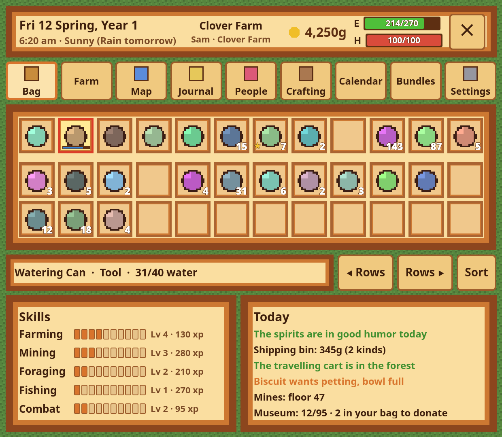
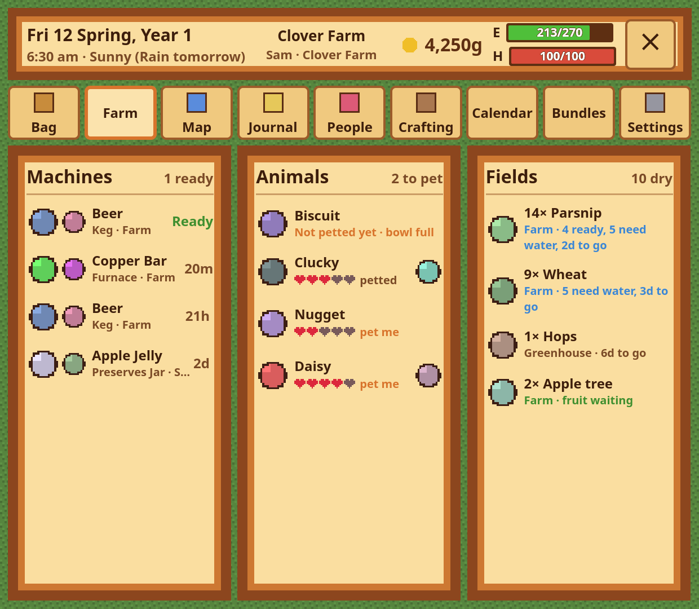
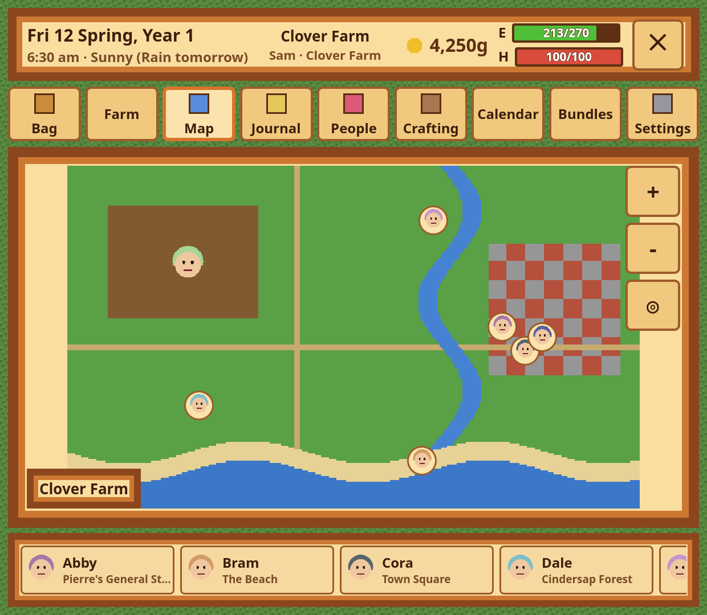
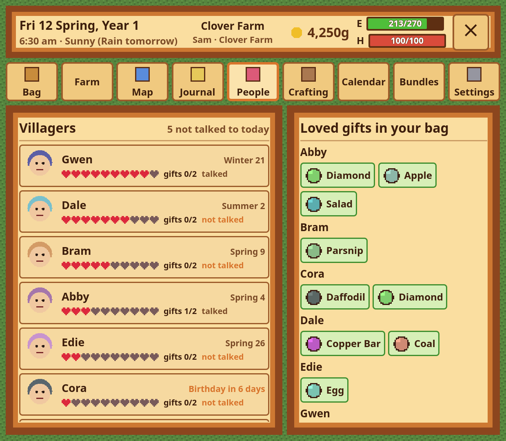
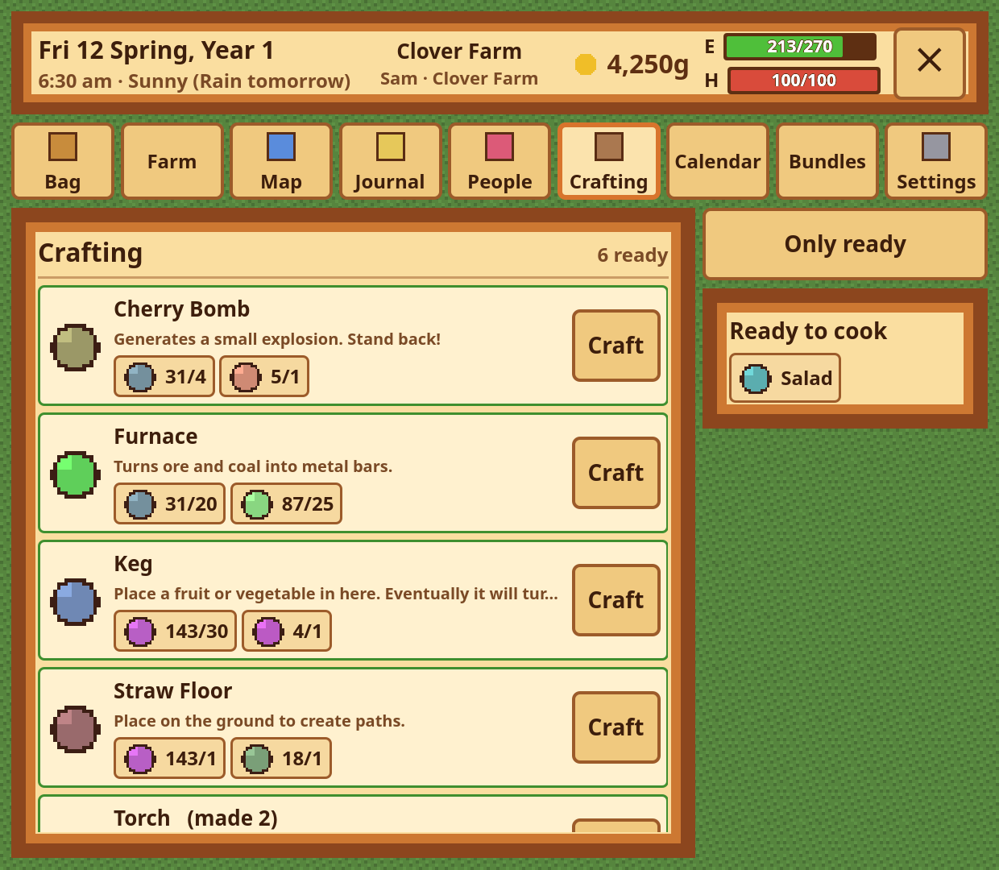
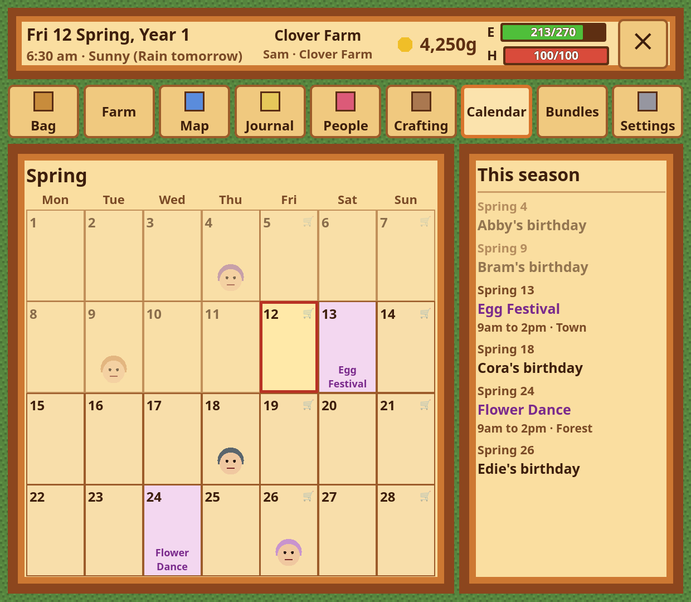

# Stardew Dual Screen for Barry Launcher

> [!IMPORTANT]
> **This repo was built with a coding agent: [Claude Code](https://www.anthropic.com/claude-code),
> running Anthropic's Claude Opus 5.5 (`claude-opus-5-5`).** Claude wrote the
> code, the commit messages and this README. People set the goals, made the
> decisions and did the hands-on testing. Review the code before you rely on
> it. See [a note from lavachemist](https://github.com/project-barry), a human, on Project Barry and generative AI.

> [!NOTE]
> ## Credit where it's due
>
> **This app exists because of the Stardew Valley Dual Screen Mod by Profmags**, published by
> **[JoeCorrell](https://github.com/JoeCorrell)** in
> **[AYN Thor DualScreen Mods](https://github.com/JoeCorrell/AYN-Thor-Dualscreen-Mods)**, part
> of WEMU's lower-screen companions for the AYN Thor.
>
> Their mod does all the hard work. It runs inside Stardew Valley, reads the game, cuts the
> game's own art into pictures, and takes commands from a second screen. Their Android
> **DualScreen Mods** app is the original lower-screen companion it was made for. The idea, the
> pages and the game side are theirs.
>
> This repository is only a **separate client**: a new Barry Launcher screen, written from
> scratch, that talks to their unmodified mod over the socket it already opens. It contains
> **none of their code**. It does not include or redistribute the mod, so get the mod from
> **[their releases](https://github.com/JoeCorrell/AYN-Thor-Dualscreen-Mods/releases)**.
> Project Barry is not affiliated with them, and they have not endorsed this app.
>
> If you like it, go star [their repository](https://github.com/JoeCorrell/AYN-Thor-Dualscreen-Mods).
> Report problems with the mod or the game side to them. Report problems with this screen here.

Stardew Valley's companion screen on the AYN Thor's bottom screen under
[PB-OS](https://github.com/project-barry/pb-os), as a
[Barry Launcher](https://github.com/project-barry/barry-launcher) app. While it is connected,
the game's HUD moves from the top screen to here, along with everything else the mod sends:
your bag, the farm, the map, quests, villagers, recipes, the calendar and the Community Center.

| | |
|---|---|
|  |  |
|  |  |
|  |  |

*The screenshots come from `tools/fake_stardew.py`, a stand-in game. Its farm, its people and
its blob-shaped pictures are made up. With the real game, the mod sends Stardew Valley's own art.*

## What it shows

- **Header** (the game's HUD): the date and season, the clock and weather (today's and
  tomorrow's), where you are, gold, energy and health.
- **Bag**: the hotbar and every unlocked backpack row, with stacks, quality stars, a watering
  can's water and a weapon's cooldown.
  - Tap a hotbar slot to hold it.
  - Tap a backpack item to swap it into the slot you hold.
  - Hold an item to eat or use it.
  - **◀ Rows / Rows ▶** rotates the rows through the hotbar (the mod's L/R), and **Sort** sorts
    the bag.
  - Below the bag are your skills, plus the day: luck, the shipping bin, the travelling cart, your
    pet, the mines and the museum.
- **Farm**: machines and what's in them, sorted ready first. Animals, with hearts, petted or not,
  and their produce. Crops grouped by kind and place, with how many are ready or dry. Fruit trees
  with fruit waiting.
- **Map**: the valley map with your farmer's face on it. With the 2.0 mod, villagers appear where
  they are; tap a name to find them. Drag to move the map, and pinch or use + and − to zoom.
- **Journal**: quests with their objectives, days left and rewards. Tap a quest for its details,
  and cancel it where the game allows (the app asks first). Special orders are listed too.
- **People**: villagers with hearts, gifts this week, whether you've talked today, and birthdays.
  Tap one to see what they love; anything in your bag is lit. With no one picked, it lists every
  loved gift you're carrying.
- **Crafting**: with the 2.0 mod, every recipe you know, its ingredients (how many you have of
  each) and a **Craft** button. With 0.3, what you can craft now. Recipes you can cook are listed
  too.
- **Calendar**: the season's four weeks, with birthdays (and portraits), festivals with their time
  and place, and the travelling cart's days.
- **Bundles**: Community Center bundles still to finish, by room, and what each one is missing.
  Anything in your bag is lit. Museum pieces you could donate are listed beside them.
- **Settings**: the mod's own options (saved in its `config.json`), a backdrop picked from the
  game's ground tiles, the game's address, and credits.

## Using it

1. **In Stardew Valley:** install [SMAPI](https://smapi.io/). Then install the mod's
   `StardewDualScreenMod.zip` from
   [its releases](https://github.com/JoeCorrell/AYN-Thor-Dualscreen-Mods/releases) into the
   game's `Mods` folder, following their instructions. Start the game through SMAPI and load a
   save.
2. **On the Thor:** get `stardew-VERSION.zip` from this repository's
   [releases](https://github.com/project-barry/stardew-dual-screen/releases). Install it with the
   Barry Launcher Decky plugin (Apps › Install app) or with `barry-app install stardew-VERSION.zip`.
3. Open **Stardew Dual Screen** in Barry Launcher. It looks for the game on the same device
   (`127.0.0.1:7786`) and keeps trying until the game is there.

For a game running on another computer, type that computer's address on the waiting screen or in
Settings. The mod there needs `"AllowRemote": true` in its `config.json`. The socket has no
password, which is why that option is off by default.

The app works with the mod's **2.0** release and with the older **0.3** source. 0.3 lacks the
Craft button, villager positions and a few details.

## How it works

The mod opens a WebSocket on `ws://127.0.0.1:7786` and sends the game's state as JSON, one
object per message. It also sends the game's art, as PNG pictures that it sends once each. The app
sends small JSON commands back. Qt's QML WebSocket type is enough, so unlike the
[Pip-Boy app](https://github.com/project-barry/PyPipboyApp), this one needs no service: it's
plain QML.

[docs/protocol.md](docs/protocol.md) lists the messages and commands as this app uses them.
They were worked out from the mod's published source (0.3) and from its 2.0 release, for
compatibility only.

```
app/                the Barry Launcher app (barry-app.json, main.qml, qml/)
tools/fake_stardew.py   a stand-in game: the mod's socket with a made-up farm
tools/smoke_test.py     checks a socket the way the app uses it (CI)
docs/protocol.md        the messages
```

## Trying it without the game

```sh
python3 tools/fake_stardew.py &        # the "game", on port 7786 (--old acts like the 0.3 mod)
barry-app run app                      # the app, in a 1240 x 1080 window
```

`barry-app run` needs Qt 6's `qml` tool and its WebSockets module. See the
[Barry Launcher apps wiki](https://github.com/project-barry/barry-launcher-apps/wiki).

## Status

The app has been tested against the stand-in game: every page, every command, both mod versions,
and the waiting screen. It ran in PB-OS's own Qt in a VM. It has **not** yet been tested with
the real Stardew Valley, or by touch on a Thor. Whether Stardew Valley with SMAPI runs well on
PB-OS is a separate question that this app does not answer.

## License

This repository's code is under the [MIT License](LICENSE).

The Stardew Valley Dual Screen Mod belongs to its authors, Profmags and JoeCorrell. It is not
part of this repository. Stardew Valley and its art belong to ConcernedApe; the mod sends that art
from your own copy of the game, and none of it is stored here.
